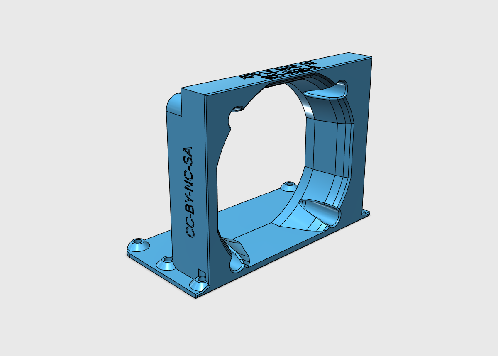
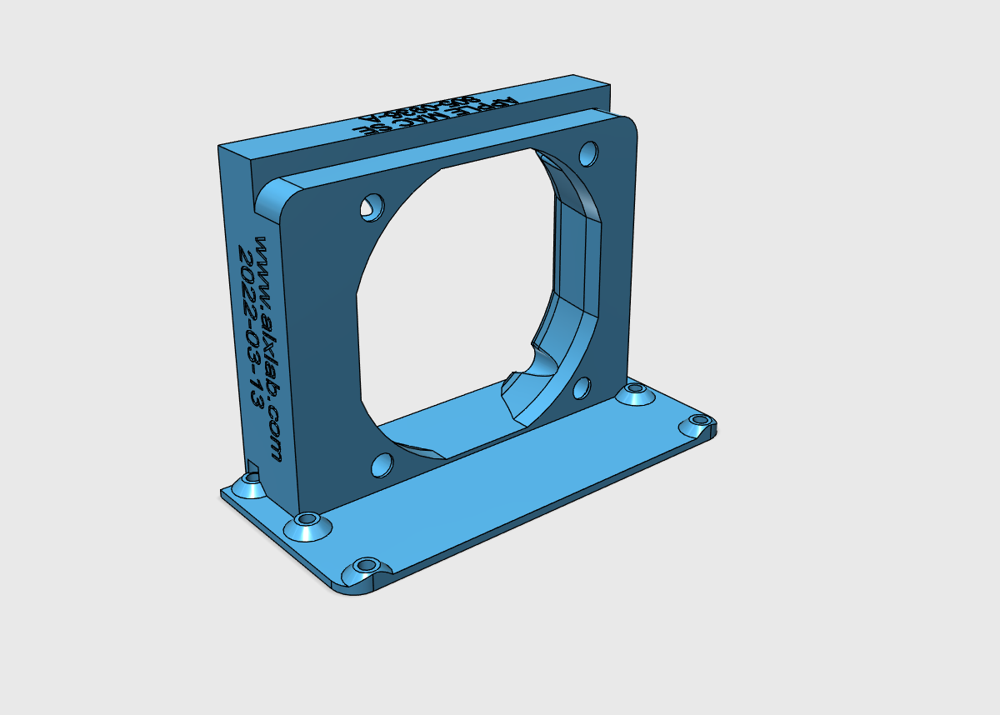
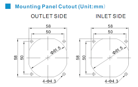

[alxlab GitHub Repositories](https://github.com/alxlab-zone66x?tab=repositories)

# Macintosh SE Fan Bracket 805-0936-A

This is a fan bracket for the Macintosh SE or SE/30 analog board. It's an alternative to the original 805-0936-A metal bracket for a 60mm fan. Unlike the original Apple part though, this will work with either the horizontal or vertical neck PCB. The fan air intake cutout shape is based on these dimensions:

The fan is secured using standard fan screws that come with most fans. The bracket is attached to the analog board using 6-32 pan head screws that are commonly used for computer cases and 3.5" hard drives. There's 6 holes to mount it but 4 is more than enough. The fan used should be 12V.

## Printing Notes

This can be printed without supports. If you're using a FDM printer with a 0.4mm nozzle like I am, then I would recommend printing with at least 3 outer/shell layers to give more strength to the screw holes. 

## Bill of Materials

| Quantity | Product Number                          |
| :------- | --------------------------------------- |
| 4+       | 6-32 1/4" pan head screws               |
| 4        | fan screws (usually comes with the fan) |
| 1        | 60mm fan, 12V                           |

## License

<a property="dct:title"  rel="cc:attributionURL"  href="https://github.com/alxlab-zone66x/Macintosh_SE_Fan_Bracket_805-0936-A">Macintosh  SE Fan Bracket 805-0936-A</a> by <a rel="cc:attributionURL  dct:creator" property="cc:attributionName"  href="https://www.alxlab.com">Alexandre Marcoux</a> is licensed  under <a  href="http://creativecommons.org/licenses/by-nc-sa/4.0/?ref=chooser-v1"  target="_blank" rel="license noopener noreferrer"  style="display:inline-block;">CC BY-NC-SA 4.0</a>
  

## Community

For more great retro hardware projects and a great community check out:

Join us in #skunkworks on [Discord](https://discord.gg/GKcvtgU7P9) to help make retro solutions available to all.

